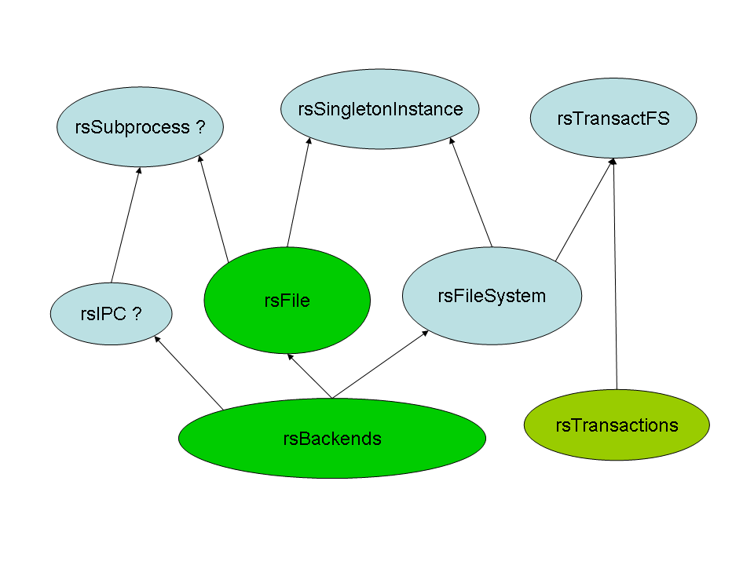

.. RockSolidTools documentation master file, created by Pascal Chambon

Welcome to RockSolidTools' documentation!
==========================================

This *mini-framework* aims at providing a cross-platform (unix/linux/mac/windows) object-oriented APIs for widely needed functionalities
like I/O streams, filesystem operations, inter-process communication, and generic transactional systems.

The focus is set on security and code robustness more than on execution speed, on comprehensive testing and documentation
more than on code optimisation. However, on the long term cython augmentations might be developed in parallel, and compensate
the slowness of these pure-python modules compared to stdlib C extensions.

RockSolidTools currently features two packages : **rsbackends** (a set of bridges to
native OS APIs - you shouldn't have to use it directly), and **rsfile** (a partial reimplementation of the standard io module, with advanced
features). But below is an optimistic (megalomaniac?) dependency diagram of what RockSolidTools might 
eventually contain.

.. rubric::
	**Browse the documentation:**

.. toctree::
	:maxdepth: 2
	
	rsfile.rst	

.. rubric::
	**Sources, downloads, bugs:**

All is in the `Bitbucket Repository <http://bitbucket.org/pchambon/python-rock-solid-tools/>`_.
	
.. rubric::
	**Contacts:**
	
Any feedback / bug report is highly appreciated; and if you don't feel like subscribing to mailing-lists or bug trackers,
feel free to send an email at the address below.

.. image:: email_pythoniks.png	
	
	
Indices and tables
==================

* :ref:`genindex`
* :ref:`modindex`
* :ref:`search`

